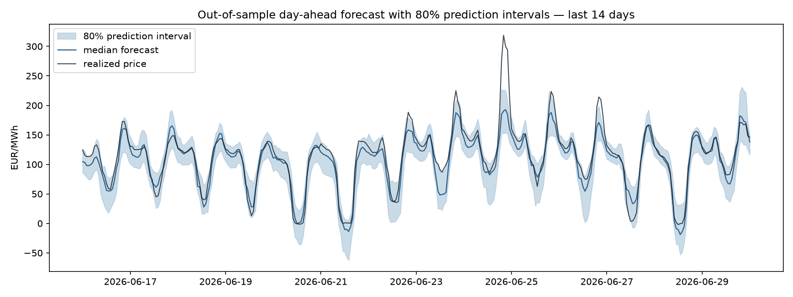
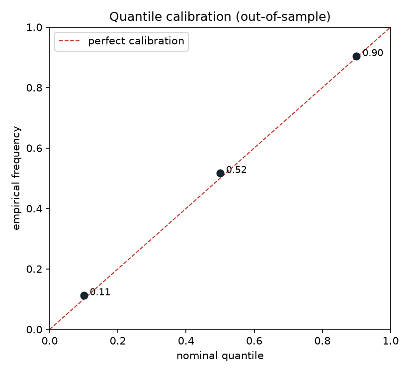

# Swiss Day-Ahead Electricity Price Forecasting

Probabilistic forecasting of Swiss day-ahead electricity prices (EPEX spot, CH bidding zone)
using public ENTSO-E data — with an emphasis on **rigorous backtesting** and
**calibrated uncertainty quantification**.

> **Why this project?** Electricity prices are among the most volatile time series in any
> market: strong multiple seasonality, regime shifts, negative prices, and fat-tailed spikes.
> This makes them an ideal testbed for methods I developed in experimental particle physics —
> extracting non-stationary trends from noisy data with controlled, sub-percent precision
> (LHC luminosity calibration) and quantifying uncertainty honestly.

## Results (snapshot)

**Key findings**
- LightGBM beats the naive baseline by 29% MAE (11.4 vs 16.3 EUR/MWh), with
  non-overlapping bootstrap CIs.
- Raw quantile regression was overconfident: 56.5% empirical coverage on a
  nominal 80% interval. A conformal correction (CQR) restored it to 79.1%.
- Point accuracy and interval calibration trade off through the calibration
  split — in production you'd use both models, each for what it does best.

*Walk-forward backtest, Jan 2024 – Jun 2026 evaluation period (first year reserved for initial training), ~29k out-of-sample hourly predictions.*

| Model | MAE (EUR/MWh) [68% CI] | RMSE | Pinball (q10/q50/q90) | Coverage 80% PI |
|---|---|---|---|---|
| Naive (D-1) | 16.28 [15.86, 16.68] | 27.45 | – | – |
| Seasonal naive (D-7) | 19.07 [18.54, 19.48] | 30.58 | – | – |
| LightGBM (point) | 11.55 [11.31, 11.78] | 17.94 | – | – |
| LightGBM (quantile) | 11.42 [11.16, 11.67] | 18.42 | 3.37 / 5.71 / 2.87 | 56.5% |
| LightGBM + CQR | 12.75 [12.46, 13.02] | 19.68 | 3.20 / 6.37 / 2.89 | 79.1% |




## Methodology

1. **Data** — ENTSO-E Transparency Platform (free API): day-ahead prices (CH, DE-LU, FR),
   Swiss load forecast, German wind & solar generation forecasts. Hourly resolution,
   2023–2026.
2. **Features** — calendar effects (hour, day-of-week, month), lagged prices (D-1, D-2, D-3, D-7),
   rolling statistics, load/renewables forecasts available *before* gate closure
   (strict no-look-ahead policy, enforced by unit tests).
3. **Models** — hierarchy of increasing complexity, each judged against honest baselines:
   naive & seasonal naive → LightGBM point forecast → LightGBM quantile regression →
   conformalized quantile regression (CQR) for calibrated prediction intervals.
4. **Backtesting** — expanding-window walk-forward validation. No random shuffling, ever.
   Metrics: MAE, RMSE, pinball loss, empirical coverage of prediction intervals.
5. **Uncertainty** — quantile models are only useful if calibrated: we report empirical
   coverage vs. nominal and reliability diagrams, not just point metrics.

## Limitations (read this first)

- Day-ahead auction prices only; no intraday or balancing markets.
- Fuel prices (gas, CO2) not yet included — a known driver of price levels.
- Results are in-sample-period specific: performance during the backtest window does not
  guarantee performance out of it (regime changes, market coupling changes).
- CQR guarantees marginal, not conditional, coverage: intervals remain too narrow during price spikes. Adaptive conformal methods are the natural next step.

## Project structure

```
src/elecprice/
    data.py        # ENTSO-E ingestion + local parquet caching
    features.py    # feature engineering (leak-free by construction)
    models.py      # baselines, LightGBM point & quantile
    conformal.py   # conformalized quantile regression (CQR)
    backtest.py    # walk-forward engine + metrics
tests/             # unit tests (features, backtest integrity)
notebooks/         # EDA and result notebooks
```

## Quickstart

```bash
pip install -r requirements.txt
cp .env.example .env        # add your free ENTSO-E API token
python -m elecprice.data --start 2023-01-01 --end 2026-06-30   # download & cache
pytest                       # run tests
python notebooks/01_eda.py       # exploratory figures
python notebooks/02_backtest.py  # full walk-forward backtest (~10 min)
```

Get a free API token: register on [ENTSO-E Transparency](https://transparency.entsoe.eu/),
then email transparency@entsoe.eu requesting RESTful API access.

## Author

**Diallo Boye** — PhD in particle physics (CERN/ATLAS), Goldhaber Distinguished Fellow at
Brookhaven National Laboratory. Background in statistical inference, rare-signal extraction
and precision time-series calibration on LHC data.
